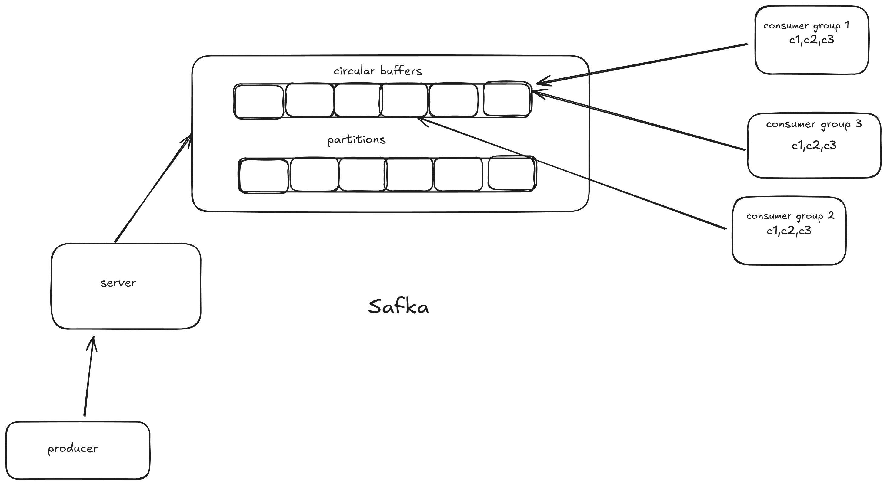

# 🦀 Safka - A Kafka-like Message Broker in Rust

**Safka** (short for *small Kafka*) is a lightweight, high-performance message broker inspired by Apache Kafka, built from scratch in **Rust** using the **Tokio** asynchronous runtime.

This project is developed to understand and explore the internals of distributed messaging systems like Kafka including producers, consumers, partitions, consumer groups, and message offsets.

---

## ✨ Features

- Built with **Rust** and **Tokio** for high performance and concurrency
- Support for **multiple partitions** per topic using circular queue data structure
- **Round-robin message routing** across partitions
- **Multiple consumer groups**, each maintaining independent offsets using HashMap
- Persistent, append-only message storage (coming soon)
- Consumer **rebalancing** logic 
- Dockerized for easy development and testing

---

## 📐 Architecture Overview

The architecture of Safka consists of:

- **Producers**: Send messages to a topic
- **Broker**: Accepts incoming messages and routes them to partitions
- **Partitions**: Circular queue-based storage units inside each topic for efficient message buffering
- **Consumers**: Receive messages from specific partitions
- **Consumer Groups**: Multiple consumers grouped logically to consume the same topic independently
- **Offset Management**: Each consumer group maintains its own offset per partition using HashMap for fast lookups

The system leverages two key data structures:
- **Circular Queue**: For efficient message storage and retrieval within each partition
- **HashMap**: For fast offset tracking and consumer group management

See the image below for the visual representation:


---

## 🚀 Installation

### 🛠️ Requirements

- Rust (>= 1.70)
- Cargo
- Docker (optional, for containerized deployment)

### 🔧 Clone & Build

```bash
git clone https://github.com/your-username/safka.git
cd safka
cargo build --release
```

### 🐳 Run with Docker

```bash
docker build -t safka -f docker/Dockerfile.local .
docker run -p 9000:9000 safka
```

---

## ⚙️ Usage

### 🧑‍💻 Start the Broker

```bash
cargo run
```

By default, the broker listens on `0.0.0.0:9000`.

---

## 📁 Project Structure

```
.
├── arc.png                  # Architecture diagram
├── Cargo.lock
├── Cargo.toml               # Rust project metadata
├── docker/
│   └── Dockerfile.local     # Dockerfile for local development
├── README.md
└── src/
    ├── circularBuffer.rs    # Circular queue implementation for partition storage
    ├── deserializer.rs      # Protocol decoding logic
    ├── groups.rs            # Consumer group tracking and offset management with HashMap
    ├── handler.rs           # Main TCP request handler
    ├── main.rs              # App entry point
    ├── partitionManager.rs  # Partition routing & management with circular queue
    └── server.rs            # Core TCP server
```

---

## 🔧 Core Data Structures

### Circular Queue
Each partition uses a circular queue for efficient message storage:
- **Fixed-size buffer** for memory management
- **FIFO (First In, First Out)** message ordering
- **Constant time** O(1) insertion and removal
- **Wrap-around behavior** for continuous operation

### HashMap
Used for offset,consumer and consumer group management:
- **Fast lookups** O(1) average case for consumer group offsets
- **Efficient storage** of partition-to-offset mappings
- **Dynamic scaling** as consumer groups are added/removed

---

## 🤝 Contributing

1. Fork the repository
2. Create your feature branch:
   ```bash
   git checkout -b my-feature
   ```
3. Commit your changes:
   ```bash
   git commit -m 'Add some feature'
   ```
4. Push to the branch:
   ```bash
   git push origin my-feature
   ```
5. Open a pull request 🚀

---

## 📬 Contact

For questions, issues, or contributions, please open an issue on GitHub or reach out via:

📧 raj96yt@gmail.com
